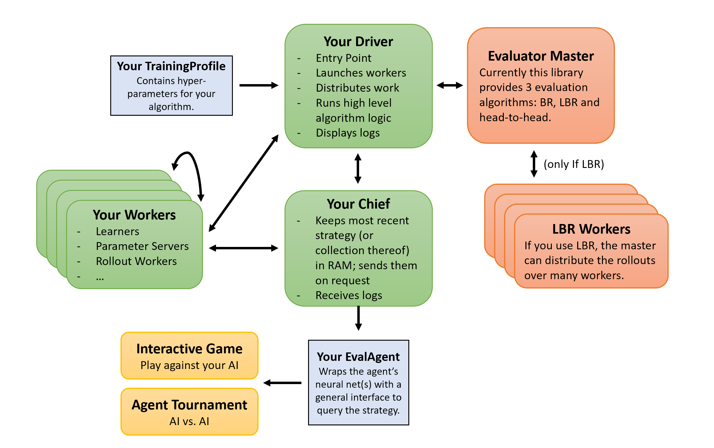

# PokerRL

Framework for Multi-Agent Deep Reinforcement Learning in Poker games.


## Background
Research on solving imperfect information games has largely revolved around methods that traverse the full game-tree
until very recently (see
[[0]](http://martin.zinkevich.org/publications/regretpoker.pdf),
[[1]](http://poker.cs.ualberta.ca/publications/2015-ijcai-cfrplus.pdf),
[[2]](https://papers.nips.cc/paper/3713-monte-carlo-sampling-for-regret-minimization-in-extensive-games.pdf),
for examples).
New algorithms such as Neural Fictitious Self-Play (NFSP)
[[3]](http://discovery.ucl.ac.uk/1549658/1/Heinrich_phd_FINAL.pdf),
Regret Policy Gradients (RPG) [[4]](https://arxiv.org/pdf/1810.09026.pdf),
Deep Counterfactual Regret Minimization (Deep CFR) [[5]](https://arxiv.org/pdf/1811.00164.pdf),
and Single Deep CFR [[8]](https://arxiv.org/pdf/1901.07621.pdf)
have recently combined Deep (Reinforcement) Learning with conventional methods like CFR and Fictitious-Play to learn
approximate Nash equilibria while only ever visiting a fraction of the game's states.


## PokerRL Framework

### Components of a PokerRL Algorithm

Your algorithm consists of workers (green) that interact with each other. Arguments for a training run are 
passed through an instance of a _TrainingProfile_ (`.../rl/base_cls/TrainingProfileBase`).
Common metrics like best-response or head-to-head performance can be measured periodically by separate
workers (red). Your trained agent is wrapped in an EvalAgent (`.../rl/base_cls/EvalAgentBase`).
Your EvalAgent can battle other AIs in an AgentTournament (`.../game/AgentTournament`)
or play against humans in an InteractiveGame (`.../game/InteractiveGame`). All local workers (just classes)
can be wrapped with ~4 lines of code to work as an independent distributed worker. 

Some parts of PokerRL work only for 2-player games since they don't make sense in other settings. However,
the game engine itself and the agent modules are general to N>1 players.

### Evaluation of Algorithms
We provide four metrics to evaluate algorithms:

- **Best Response (BR)**  - Computes the exact exploitability (for small games).
- **Local Best Response (LBR) [[7]](https://arxiv.org/pdf/1612.07547.pdf)** approximates a lower bound of BR.
- **RL Best Response (RL-BR)** approximates BR by training DDQN [[9]](https://arxiv.org/pdf/1511.06581.pdf)
against the AI.
- **Head-To-Head (H2H)** - Let's two modes of an Agent play against each other.

Our current implementation of Best Response is only meant to be run in small games, but LBR and QBR are optimized
for distributed computing in (very) large games. As a baseline comparison in small games, there are (unoptimized)
implementations of
vanilla CFR [[10]](http://martin.zinkevich.org/publications/regretpoker.pdf),
CFR+ [[11]](https://arxiv.org/abs/1407.5042)
and Linear CFR [[12]](https://arxiv.org/pdf/1809.04040.pdf)
that can be run just like a Deep RL agent and will plot their exploitability to TensorBoard.

### Performance & Scalability
Whilst past algorithms had performance concerns mostly related to computations on the game-tree, these sampling 
based approaches have most of their overhead in querying neural networks. PokerRL provides an RL environment and a 
framework ontop of which algorithms based on Deep Learning can be built and run to solve poker games. PokerRL provides
a wrapper for ray [[6]](https://github.com/ray-project/ray) to allow the same code to run locally, on many cores, or
even on a cluster of CPU and potentially GPU workers.


## Installation
These instructions will guide you through getting PokerRL up and running on your local machine and
explain how to seamlessly deploy the same code you developed and tested locally onto an AWS cluster.

### Prerequisites
This codebase is OS agnostic for local runs but supports only Linux for distributed runs due to limitations of
 [ray](https://github.com/ray-project/ray).

### Installation on your Local Machine
First, please install Anaconda/Miniconda and Docker. Then run the following commands (insert details where needed):
```
conda create -n CHOOSE_A_NAME python=3.6 -y
source activate THE_NAME_YOU_CHOSE
pip install requests
conda install pytorch=0.4.1 -c pytorch
```
and then
```
pip install PokerRL
```
Note: For distributed runs you would need Linux and also `pip install PokerRL[distributed]`. This is not required for
local-only usage.

This framework uses [PyCrayon](https://github.com/torrvision/crayon), a language-agnostic wrapper around
Tensorboard. Please follow the instructions on their GitHub page to set it up. After you have installed PyCrayon, you
can run and start the log server via
```
docker run -d -p 8888:8888 -p 8889:8889 --name crayon alband/crayon
docker start crayon
```
Now try to access Tensorboard in your browser at `localhost:8888`.

#### Running some Tests
Run this command in the directory containing PokerRL to check whether all unittests pass. 
```
python -m unittest discover PokerRL/test
``` 
A more fun way to test whether your installation was successful, is running `examples/interactive_user_v_user.py` to
play poker against yourself and `examples/run_cfrp_example.py` to train a CFR+ agent in a small poker game.

## Cloud & Cluster
PokerRL provides an interface that allows the exact same code to run locally and on a cluster by utilizing
[ray](https://github.com/ray-project/ray). PokerRL supports two modes:
1. _Distributed_: Run many worker processes on a single machine with many cores
2. _Cluster_: Run many workers on many machines

You can enable/disable distributed and cluster mode by switching a boolean in the TrainingProfile.
This section assumes you developed your algorithm using a pip-installed version of PokerRL.

Examples of algorithms compatible with distributed PokerRL are this
[implementation of Neural Fictitious Self-Play](https://github.com/TinkeringCode/Neural-Fictitous-Self-Play) [8].
and this
[implementation of Single Deep CFR](https://github.com/TinkeringCode/Single-Deep-CFR) [3]

### Local or Distributed Mode on an AWS instance
1. Fire up any AWS instance that suits your needs over the management console. This tutorial assumes your base AMI is
"Amazon Linux 2 AMI (HVM), SSD Volume Type". Note: It is important that you add the following allowance to your security group to be able to view logs:
    ```
    Custom TCP Rule   |   TCP   |   8888   |   Your_IP   |   Tensorboard
    ```
1. Run the following commands on the instance:
    ```
    sudo yum update -y
    sudo yum install git gcc g++ polkit -y
    sudo amazon-linux-extras install docker -y
    sudo service docker start
    sudo docker pull alband/crayon 
    wget https://repo.anaconda.com/miniconda/Miniconda3-latest-Linux-x86_64.sh
    bash Miniconda3-latest-Linux-x86_64.sh -b -p /home/ec2-user/miniconda
    export PATH=/home/ec2-user/miniconda/bin:$PATH
    conda create -n PokerAI python=3.6 -y
    source activate PokerAI
    pip install requests
    conda install pytorch=0.4.1 -c pytorch -y
    pip install PokerRL[distributed]
    ```
1. Grant your instance access to your codebase so that it can `git pull` later on.

1. Create an AMI (i.e. Image of your instance) to be able to skip the past steps in the future.

1. Every time you fire up a new instance with your AMI, execute
    ```
    sudo service docker start
    sudo docker inspect -f {{.State.Running}} crayon || sudo docker run -d -p 8888:8888 -p 8889:8889 --name crayon alband/crayon
    sudo docker start crayon
    
    screen
    export OMP_NUM_THREADS=1
    export PATH=/home/ec2-user/miniconda/bin:$PATH
    source activate PokerAI
    source deactivate
    source activate PokerAI
    ```
    You have to set `OMP_NUM_THREADS=1` because of a bug in PyTorch 0.4.1 that ignores core/process limits. This is
    fixed in PyTorch 1.0, but 1.0 is actually slower for the recurrent networks than 0.4.1 in many cases.

1. The usual syntax to start any algorithm run should be something like
    ```
    cd PATH/TO/PROJECT
    git pull
    python YOUR_SCRIPT.py
    ```
    
1.  In your browser (locally), please go to `AWS_INSTANCE_PUBLIC_IP:8888` to view logs and results.

### Deploy on a cluster
The step from distributed to cluster only requires changes as documented by [ray](https://github.com/ray-project/ray).
Once you have your cluster specification file (`.yaml`) and your AWS account is set up, just enable the `cluster`
option in your TrainingProfile and start your cluster via ray over the command line.

## Notes
An optional debugging tool that can plot the full game-tree with an agent's strategy in tiny games.
The code for that (authored by Sebastian De Ro) can be downloaded from
[here](https://drive.google.com/file/d/1Oo4OyKZuO46GGnTQgWTqvX9z-BW_iShJ/view?usp=sharing).
To install it, just drag the PokerViz folder directly onto your `C:/` drive (Windows) or in your `home` directory
(Linux). PokerRL will then detect that it is installed and export visualizations when you run Best Response on small
games. To view the trees, go into the `data` directory and rename the tree you want to view to `data.js` and then open
`index.html`.


Note that the Python code imports small bits of functionality exported from C++ to .dll and .so files, for Win and Linux
respectively. Only the binaries are included with this repository.

## Citing
If you use PokerRL in your research, you can cite it as follows:
```
@misc{steinberger2019pokerrl,
    author = {Eric Steinberger},
    title = {PokerRL},
    year = {2019},
    publisher = {GitHub},
    journal = {GitHub repository},
    howpublished = {\url{https://github.com/TinkeringCode/PokerRL}},
}
```


## Authors
* **Eric Steinberger**


## License
This project is licensed under the MIT License - see the [LICENSE](LICENSE) file for details.


## Acknowledgments
I want to thank Alexander Mandt for getting ray to run on our local cluster of 64 workers and HTL Spengergasse for
providing it. Sebastian De Ro developed a game tree visualisation
[tool](https://github.com/sebastiandero/js-visualize-best-response-tree) that we integrated into PokerRL and
contributed to our batched poker hand evaluator written in C++.

## References
[0] Zinkevich, Martin, et al. "Regret minimization in games with incomplete information." Advances in neural information
processing systems. 2008.

[1] Tammelin, Oskari, et al. "Solving Heads-Up Limit Texas Hold'em." IJCAI.dc 2015.

[2] Lanctot, Marc, et al. "Monte Carlo sampling for regret minimization in extensive games." Advances in neural
information processing systems. 2009.

[3] Heinrich, Johannes, and David Silver. "Deep reinforcement learning from self-play in imperfect-information games."
arXiv preprint arXiv:1603.01121 (2016).

[4] Srinivasan, Sriram, et al. "Actor-critic policy optimization in partially observable multiagent environments."
Advances in Neural Information Processing Systems. 2018.

[5] Brown, Noam, et al. "Deep Counterfactual Regret Minimization." arXiv preprint arXiv:1811.00164 (2018).

[6] https://github.com/ray-project/ray

[7] Lisy, Viliam, and Michael Bowling. "Equilibrium Approximation Quality of Current No-Limit Poker Bots." arXiv
preprint arXiv:1612.07547 (2016).

[8] Steinberger, Eric. "Single Deep Counterfactual Regret Minimization." arXiv preprint arXiv:1901.07621 (2019).

[9] Wang, Ziyu, et al. "Dueling network architectures for deep reinforcement learning."
arXiv preprint arXiv:1511.06581 (2015).

[10] Zinkevich, Martin, et al. "Regret minimization in games with incomplete information." Advances in neural
information processing systems. 2008.

[11] Tammelin, Oskari. "Solving large imperfect information games using CFR+." arXiv preprint arXiv:1407.5042 (2014).

[12] Brown, Noam, and Tuomas Sandholm. "Solving Imperfect-Information Games via Discounted Regret Minimization."
arXiv preprint arXiv:1809.04040 (2018).
